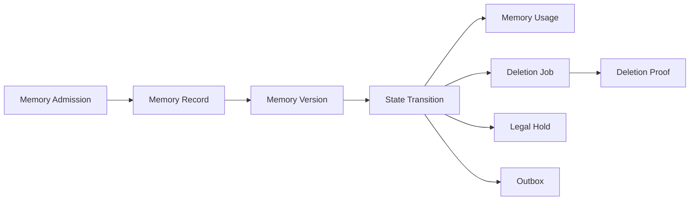
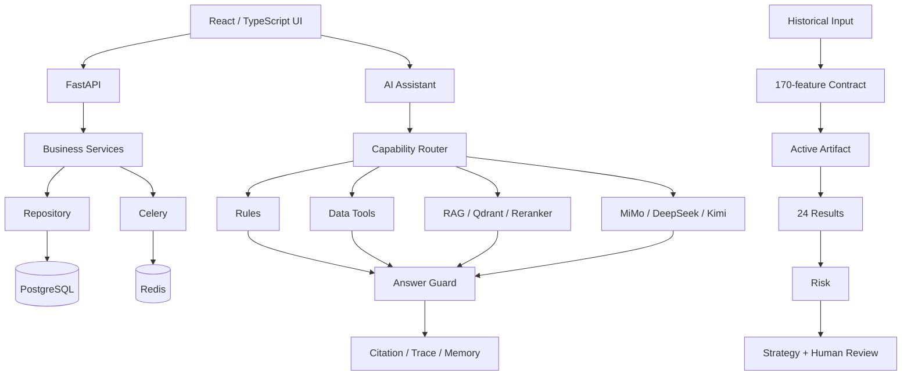
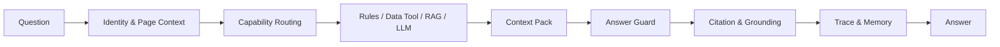

<p align="center">
  <strong>简体中文</strong> · <a href="README_EN.md">English</a>
</p>

<p align="center">
  
</p>

# Intelligent Operation

## 智能电力运营分析与 AI 决策支持平台

**数据治理 · 24小时预测 · 策略证据链 · 企业RAG · 多模型路由 · 长短期记忆**

将电力运营数据、模型预测、风险研判、策略证据与企业知识，统一到一个可追溯的 AI 决策工作台。

<p>
  <a href="https://github.com/wyg916/PowerAnalytics/stargazers"></a>
  <a href="https://github.com/wyg916/PowerAnalytics/network/members"></a>
  <a href="LICENSE"></a>
  
  
  
  
  
  
  
  
  
</p>

`24H Forecast` · `AI Decision Support` · `Enterprise RAG` · `Multi-LLM Routing` · `Long & Short-term Memory` · `Traceable Evidence`

[产品预览](#product-preview) · [核心能力](#core-capabilities) · [系统架构](#architecture) · [快速开始](#quick-start) · [演示指南](docs/DEMO_GUIDE.md) · [English README](README_EN.md) · [Releases](https://github.com/wyg916/PowerAnalytics/releases)

---

## 30 秒了解项目

- 面向售电运营、电价风险研判、数据分析和企业知识问答等决策支持场景。
- 输入历史价格、负荷、天气、日历、运营事实和企业文档，并保留来源与时间口径。
- 以严格的 24 × 170 特征契约生成 24 条连续小时级预测结果。
- 将峰谷、风险窗口、预测依据与策略建议串成可人工复核的证据链。
- 由规则、受控数据工具、RAG 与 MiMo / DeepSeek / Kimi 能力路由协同回答。
- 通过 Citation、Grounding、Answer Guard、Trace、RBAC 与 Memory 提升可核对性和连续性。

<a id="product-demo"></a>
## 产品演示

当前仓库不上传 65 分钟或 19 分钟的原始录屏母带。正式精剪视频尚未接入时，先以真实产品画面展示核心工作流；演示路线、问题和通过标准见 [DEMO_GUIDE.md](docs/DEMO_GUIDE.md)。

[](docs/DEMO_GUIDE.md)

<a id="product-preview"></a>
## 产品预览

以下 9 幅图片均从本项目实际运行录屏中提取，不是生成式 UI 模拟图。

<table>
  <tr>
    <td width="33%"><br><strong>总览驾驶舱</strong><br>统一查看预测、风险、策略、任务与数据健康。</td>
    <td width="33%"><br><strong>24 小时预测</strong><br>核对连续小时曲线、峰谷窗口与预测明细。</td>
    <td width="33%"><br><strong>策略证据</strong><br>把预测依据、风险等级与人工复核连接起来。</td>
  </tr>
  <tr>
    <td><br><strong>AI 短期记忆</strong><br>在同一会话继承风险偏好、重点时段和回答顺序。</td>
    <td><br><strong>跨会话长期记忆</strong><br>在新 Session 召回已准入的历史分析偏好。</td>
    <td><br><strong>RAG Citation</strong><br>把回答绑定到可展开核对的知识证据。</td>
  </tr>
  <tr>
    <td><br><strong>知识库</strong><br>治理 Document、Chunk、索引与发布状态。</td>
    <td><br><strong>模型中心</strong><br>区分 Active / Candidate，展示指标与准入门禁。</td>
    <td><br><strong>峰谷分析</strong><br>解释峰值、谷值、价差、回测与特征门禁。</td>
  </tr>
</table>

## 为什么需要这个项目

传统分析流程常把数据处理、预测脚本、策略研判、知识检索和报告生成分散在不同工具中。结果是时间口径难对齐、预测与策略之间缺少证据、知识难复用、AI 回答没有引用，多轮分析也容易丢失上下文。

Intelligent Operation 用同一条可追溯事实链连接 PostgreSQL、预测运行、风险窗口、策略复核、企业 RAG、AI 回答、Citation、Trace 与 Memory。它的目标不是替代业务判断，而是让分析人员更快看清“数据从哪里来、模型为什么这样判断、建议依据是什么、哪些内容仍需人工确认”。

<a id="core-capabilities"></a>
## 核心能力

### 1. 数据治理与运营驾驶舱

- 统一数据概览、质量状态、业务时间、更新时间、指标和风险窗口。
- PostgreSQL 作为主要事实源，前端只通过 Backend API 访问业务数据。
- Loading、Empty、Error、Stale、Unauthorized、Forbidden 等状态不被静态成功态掩盖。
- 来源、批次、场景和生成信息保留在后端审计链中，不在业务页面泄露内部追溯字段。

### 2. 24 小时预测

- 基于历史价格、负荷、天气和时间特征构造预测输入。
- 以 170 个唯一、有序特征作为严格契约；列、类型、顺序、时区或 Schema hash 不一致时 fail closed。
- 唯一 Active Artifact 通过准入后执行推理，成功运行固定形成 24 条连续小时级结果。
- 通过 `run_id`、模型版本、特征版本、输入 hash 与结果 hash 追踪预测事实。

> 当前公开演示采用历史数据回放，不描述为实时电力市场在线预测。

### 3. 风险与策略证据链

- 从峰谷时段、价格波动和置信度识别重点风险窗口。
- 策略建议绑定预测依据、运行事实和风险等级。
- 报告与策略共享可追溯 `run_id`，避免跨批次拼接。
- 策略只用于辅助决策，保留人工复核边界，不自动触发交易或资金动作。

### 4. 多模型 AI 编排

- MiMo、DeepSeek、Kimi 按通用问答、复杂分析、视觉或高质量能力进行配置化路由。
- 规则、数据库事实、领域工具、RAG 和 LLM 共同形成答案，不把所有问题直接发送给单个模型。
- 模型提供方未配置或健康探测失败时，返回 disabled / unavailable / error，不伪造外部调用成功。
- 外部 API Key 只从本机秘密配置注入，不进入源码、日志或前端。

### 5. 企业 RAG 与 Citation

- 文档经过格式检查、解析、Chunk、哈希、Embedding、Qdrant 检索和 Reranker。
- PostgreSQL Release、Qdrant Collection/Alias、Embedding 维度和模型元数据必须一致。
- Citation Binding 把答案绑定到真实证据；证据不足时不补造结论。
- 已录制演示环境达到 `80+ documents` 与 `8k+ knowledge chunks`；这些运行资产不随干净源码分发。

### 6. 长短期记忆

**短期记忆**在同一会话延续最近意图、主题、关注对象、重点时段、回答约束和工具上下文，支持连续追问。

**长期记忆**在身份隔离和准入门禁下跨会话召回已保存偏好，使新 Session 无需重复输入全部背景，并保留 Memory 使用记录。系统不会把候选内容或猜测表述为已经保存的长期事实。

### 7. 受控遗忘与记忆治理



记忆不是无限堆积，而是具有准入、版本、状态流转、使用追踪、删除证明和合规保留的治理机制。这里描述后端工程域，不伪造一个尚不存在的终端用户记忆管理页面。

### 8. 可信 AI 工程

- Answer Guard、Citation Binding 与 Grounding 限制无证据回答。
- Trace 记录身份上下文、能力路由、工具调用、引用和回答结果。
- RBAC、租户/工作区/用户隔离、参数化查询和审计限制越权访问。
- 显式长期记忆写入或召回失败时关闭该操作；普通会话状态异常进入可见降级，不跨身份回退。

### 9. 模型治理

- Active / Candidate 生命周期、模型版本、评测指标和特征契约可追踪。
- Candidate 通过验证后仍需人工确认，不能自动晋升 Active。
- 回滚要求明确目标、证据和操作边界；训练能力不被包装成默认自动闭环。

<a id="architecture"></a>
## 系统架构



更详细的预测、RAG、Memory 与部署边界见 [ARCHITECTURE.md](docs/ARCHITECTURE.md)。

## AI 决策链



身份与页面上下文决定“谁在什么场景提问”；能力路由选择最合适的规则、工具、RAG 或模型；Context Pack 组织事实；Answer Guard 校验边界；Citation 与 Grounding 绑定证据；Trace 与 Memory 负责追踪和连续性。

## 可量化工程规模

| 维度 | 稳定口径 |
|---|---:|
| 主要 Web 业务模块 | 10 |
| 受控 HTTP 路由声明 | 200+ |
| PostgreSQL 领域表 | 80+ |
| Alembic revisions | 23，单一 head |
| 预测特征契约 | 170 |
| 每次成功运行的小时级预测 | 24 |
| 已录制演示环境知识文档 | 80+ |
| 已录制演示环境知识 Chunk | 8k+ |
| 云端模型能力族 | 3 |

数字的复现方法和运行态边界见 [PROJECT_FACTS.md](docs/PROJECT_FACTS.md) 与 [PROJECT_FACTS.json](docs/PROJECT_FACTS.json)。

## 工程亮点与设计取舍

- 从业务需求、数据模型、预测、策略、AI 到 Web 交付进行端到端设计。
- 预测、报告和策略通过同一运行事实关联，不把孤立脚本输出伪装成完整闭环。
- AI 不直连任意 SQL，而是调用带权限和参数约束的领域工具。
- RAG 以证据和 Citation 为边界；检索失败或证据不足时允许拒答。
- 长短期记忆与主动遗忘同时设计，避免把“记住更多”当成唯一目标。
- 多模型路由按能力选择提供方，并保留不可用和失败状态。
- 权限、审计、迁移、模型准入和 Schema 校验优先失败关闭。
- 前端、后端、数据库、模型和 AI 在同一可追溯链路内集成。

## 独立完成范围

| 方向 | 独立完成内容 |
|---|---|
| 产品与业务 | 需求拆解、业务流程、页面信息架构 |
| 数据工程 | 数据模型、质量、时间水位、事实链 |
| 机器学习 | 特征工程、预测契约、模型 Artifact |
| AI 工程 | 多模型路由、RAG、Memory、Guard、Trace |
| 后端 | FastAPI、Service、Repository、RBAC、API |
| 前端 | React、TypeScript、ECharts、全局 AI 助手 |
| 数据库 | PostgreSQL、迁移、事务、审计 |
| 工程交付 | 启动、测试、版本治理、开源发布准备 |

项目从需求分析、架构设计到功能实现和开源交付，由作者独立完成。底层采用成熟第三方框架与基础组件；它们继续按各自许可证授权，分发者应按最终解析版本保留相应条款，不把第三方框架、模型或工具声称为作者自研。

## 技术栈

| 层 | 技术 |
|---|---|
| Frontend | React 18、TypeScript、Vite、Ant Design、ECharts |
| Backend | Python 3.11、FastAPI、Pydantic、SQLAlchemy |
| Data | PostgreSQL、Alembic、Redis、Celery |
| AI | MiMo、DeepSeek、Kimi、RAG、Qdrant、BGE、Reranker、Memory、Trace、Answer Guard |
| ML | scikit-learn、本地模型 Artifact、严格特征契约；可选 XGBoost / LightGBM |
| Engineering | Pytest、Node Test Runner、TypeScript、Vite、Playwright、PowerShell / Bash、Docker Compose |

<a id="quick-start"></a>
## 快速开始

推荐从关闭外部 LLM 与 RAG 的核心 Web 环境开始。详细的密钥、管理员初始化、数据库角色、健康检查和本地开发流程见 [QUICKSTART.md](docs/QUICKSTART.md)。

```powershell
git clone git@github.com:wyg916/PowerAnalytics.git
Set-Location PowerAnalytics
Copy-Item .env.docker.example .env.docker
# 在本机 .env.docker 中替换随机密钥和数据库密码
docker compose --env-file .env.docker config --quiet
# 完成 QUICKSTART.md 的受控管理员初始化后：
docker compose --env-file .env.docker up -d --build
```

- 访问：`http://127.0.0.1:8080`
- 健康：`http://127.0.0.1:8000/api/health`

源码开发者也可以分别启动 FastAPI 与 Vite；公开快照不携带内部机器专用的一键启动器，命令见 [QUICKSTART.md](docs/QUICKSTART.md)。

## 项目结构

```text
PowerAnalytics/
├─ frontend/             # React / TypeScript Web 工作台
├─ backend/              # FastAPI、领域服务、Repository、AI 与权限
├─ prediction_engine/    # 特征构建、训练、回测与推理
├─ model_ops/            # Artifact 准入、评估、Active/Candidate 与回滚
├─ knowledge_pipeline/   # 文档检查、解析、Chunk、Embedding 与发布工具
├─ migrations/           # PostgreSQL Alembic 迁移
├─ services/             # 跨入口的运行与编排服务
├─ tests/                # 后端、契约、AI/RAG、权限与前端测试
├─ docs/                 # 架构、启动、演示、事实与公开范围
├─ docker/               # 后端/前端镜像与容器脚本
├─ scripts/              # 启动、健康、迁移、治理与验收工具
└─ docker-compose.yml    # 本地容器编排
```

公开快照不包含原始语料、模型权重、数据库、向量快照、内部审计证据和录屏母带；详见 [OPEN_SOURCE_SCOPE.md](docs/OPEN_SOURCE_SCOPE.md)。

## 应用场景

- 电力交易辅助分析
- 售电运营分析
- 电价风险研判
- 企业知识问答
- 数据分析工作台
- AI 决策支持
- 模型和策略治理

## 使用范围

> 当前开源版本面向本地部署、技术交流与项目展示；预测演示使用历史回放数据；系统默认不执行自动交易、资金操作或生产控制动作。

该说明描述当前验证范围和默认行为，不限制 AGPL-3.0-or-later 授予的用途。

## Roadmap

- 适配更多可授权的实时或准实时数据源
- 完善模型离线评测、漂移监控与准入证据
- 增强 RAG 质量评估、可观测性与引用核验
- 提供更可移植的本地与可扩展部署方案
- 增加可配置的行业策略模板

## 文档

| 文档 | 内容 |
|---|---|
| [快速开始](docs/QUICKSTART.md) | 环境、配置、管理员初始化、启动和健康检查 |
| [系统架构](docs/ARCHITECTURE.md) | 预测、AI、RAG、Memory 与安全边界 |
| [演示指南](docs/DEMO_GUIDE.md) | 推荐路线、真实截图和已验证问题 |
| [项目事实](docs/PROJECT_FACTS.md) | 规模数字、来源与复现方法 |
| [开源范围](docs/OPEN_SOURCE_SCOPE.md) | 公开 allowlist、排除资产和发布门禁 |
| [数据和模型资产](docs/DATA_AND_MODEL_ASSETS.md) | 数据、语料、模型、向量与权利边界 |
| [媒体来源](docs/media/README.md) | 真实产品截图与品牌图的来源说明 |
| [AI 导读](README.ai.md) | 面向 AI 工具和新维护者的 1–2 页概述 |
| [贡献指南](CONTRIBUTING.md) | Issue、分支、测试、PR 与 Conventional Commits |
| [安全策略](SECURITY.md) | 私密漏洞报告和安全范围 |
| [第三方声明](THIRD_PARTY_NOTICES.md) | 直接依赖许可证、排除资产和下游义务 |

## 贡献与反馈

- 功能建议与普通缺陷：[创建 Issue](https://github.com/wyg916/PowerAnalytics/issues)
- 代码贡献：阅读 [CONTRIBUTING.md](CONTRIBUTING.md)，从 `codex/<issue>-<topic>` 分支提交 Pull Request。
- 提交信息使用 Conventional Commits，并在 PR 中给出测试、风险和回滚证据。
- 安全问题不要公开披露，按 [SECURITY.md](SECURITY.md) 检查仓库是否已启用私密报告入口。

## 许可证

PowerAnalytics 自有源码和仓库内自有文档、品牌图与产品截图按 [GNU Affero General Public License v3.0 or later](LICENSE) 发布。通过网络向用户提供修改版服务时，请特别遵守 AGPL 第 13 节的对应源码提供义务。

第三方库、容器、模型与用户自行导入的数据仍按各自许可证或条款授权，不因本项目许可证而改变；本仓库不分发模型权重、原始语料、数据库、向量快照或录屏母带。详见 [THIRD_PARTY_NOTICES.md](THIRD_PARTY_NOTICES.md) 与 [DATA_AND_MODEL_ASSETS.md](docs/DATA_AND_MODEL_ASSETS.md)。

---

项目整体方案、业务建模、数据链路、预测引擎、AI 编排、企业知识库、记忆治理、前后端集成与工程交付由作者独立设计和实现。
