<p align="center">
  <a href="README.md">简体中文</a> · <strong>English</strong>
</p>

<p align="center">
  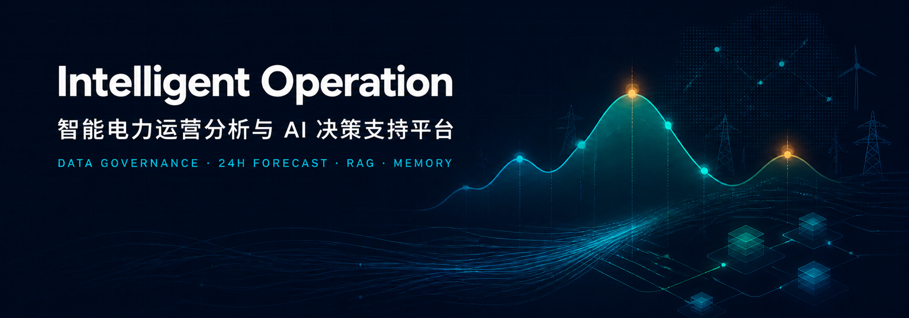
</p>

# Intelligent Operation

## AI-Assisted Power Operations Analytics and Decision Support

**Data Governance · 24-Hour Forecasting · Strategy Evidence · Enterprise RAG · Multi-Model Routing · Short- and Long-Term Memory**

PowerAnalytics brings operating data, model forecasts, risk analysis, strategy evidence, and enterprise knowledge into one traceable AI decision workspace.

<p>
  <a href="https://github.com/wyg916/PowerAnalytics/stargazers"></a>
  <a href="https://github.com/wyg916/PowerAnalytics/network/members"></a>
  <a href="LICENSE"></a>
  
  
  
  
  
  
  
  
  
</p>

`24H Forecast` · `AI Decision Support` · `Enterprise RAG` · `Multi-LLM Routing` · `Long & Short-term Memory` · `Traceable Evidence`

[Product Preview](#product-preview) · [Core Capabilities](#core-capabilities) · [Architecture](#architecture) · [Quick Start](#quick-start) · [Demo Guide](docs/DEMO_GUIDE.md) · [中文 README](README.md) · [Releases](https://github.com/wyg916/PowerAnalytics/releases)

---

## The project in 30 seconds

- Built for electricity retail operations, price-risk analysis, data investigation, and enterprise knowledge assistance.
- Takes historical prices, load, weather, calendar signals, operating facts, and authorized documents as governed inputs.
- Produces exactly 24 consecutive hourly results through a strict 24 × 170 feature contract.
- Connects peak/valley windows, risk findings, forecast evidence, and human-reviewed strategy suggestions.
- Coordinates rules, controlled data tools, RAG, and routed MiMo / DeepSeek / Kimi capabilities.
- Uses Citation, Grounding, Answer Guard, Trace, RBAC, and Memory to keep answers reviewable and continuous.

## Product demo

The repository does not publish the 65-minute or 19-minute source recordings. Until a professionally edited demo is available, the real product capture below is the entry point to the verified walkthrough in [DEMO_GUIDE.md](docs/DEMO_GUIDE.md).

[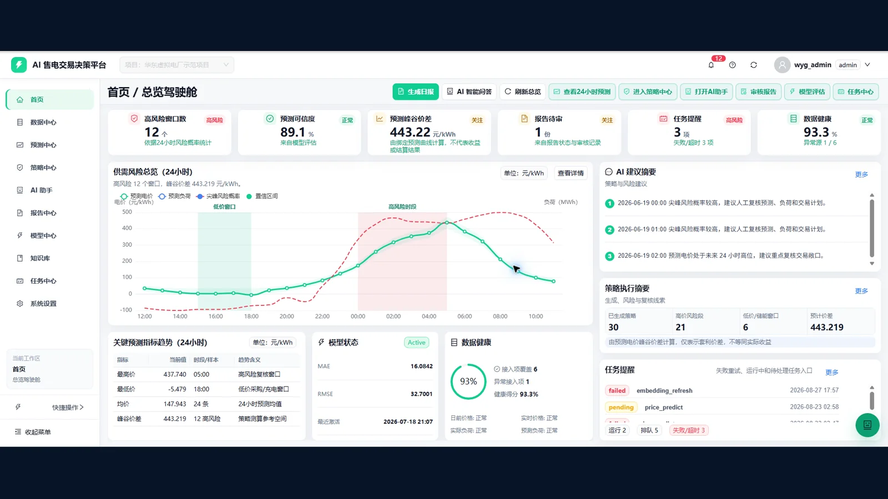](docs/DEMO_GUIDE.md)

<a id="product-preview"></a>
## Product preview

All nine images below were extracted from recordings of the running project. They are not generated UI mockups.

<table>
  <tr>
    <td width="33%"><br><strong>Operations Dashboard</strong><br>Forecasts, risks, strategies, tasks, and data health in one view.</td>
    <td width="33%">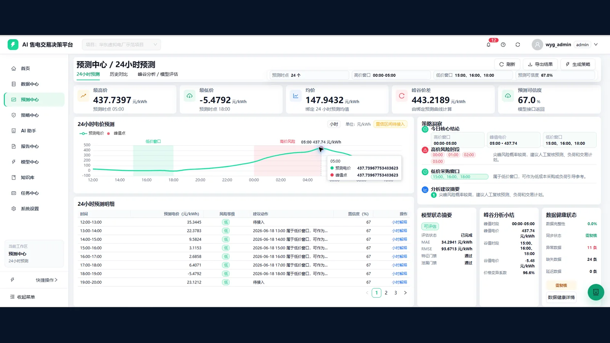<br><strong>24-Hour Forecast</strong><br>Consecutive hourly curves, peak/valley windows, and forecast details.</td>
    <td width="33%">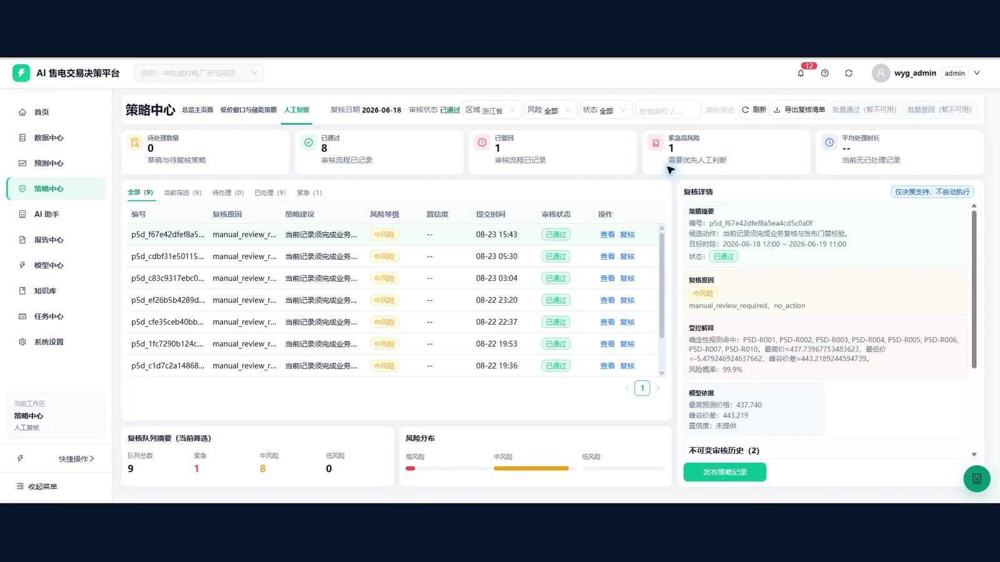<br><strong>Strategy Evidence</strong><br>Forecast facts, risk levels, and human review in one chain.</td>
  </tr>
  <tr>
    <td>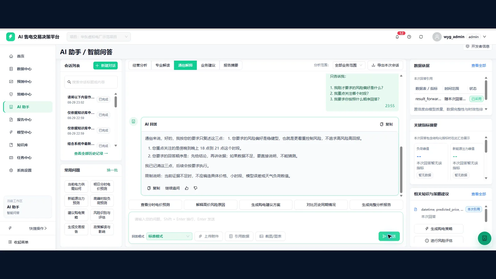<br><strong>Short-Term Memory</strong><br>Carries risk preference, focus window, and answer order across a session.</td>
    <td>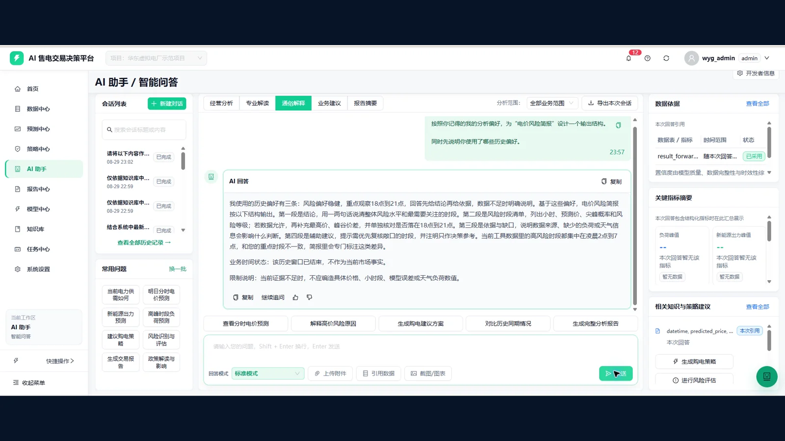<br><strong>Cross-Session Memory</strong><br>Recalls admitted analysis preferences in a new session.</td>
    <td>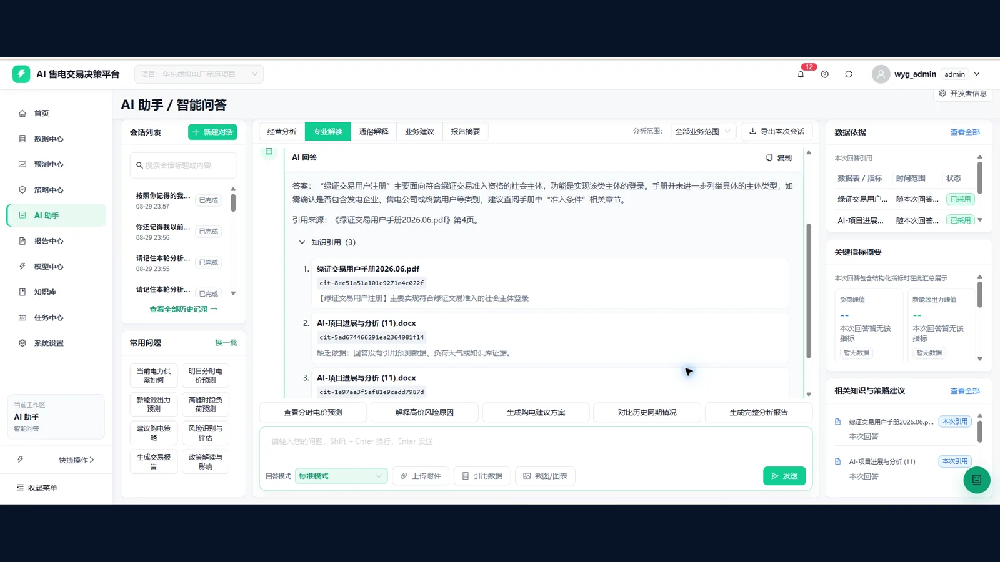<br><strong>RAG Citation</strong><br>Binds the answer to expandable, reviewable evidence.</td>
  </tr>
  <tr>
    <td>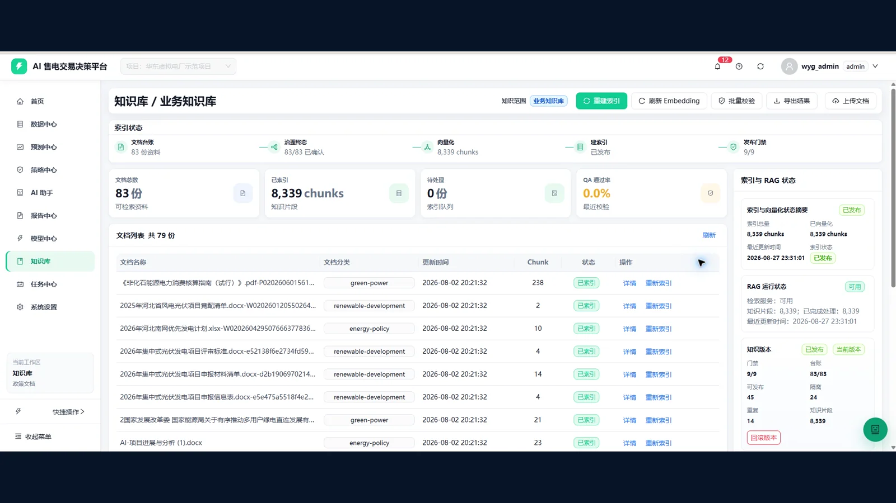<br><strong>Knowledge Base</strong><br>Governs documents, chunks, indexing, and publication state.</td>
    <td>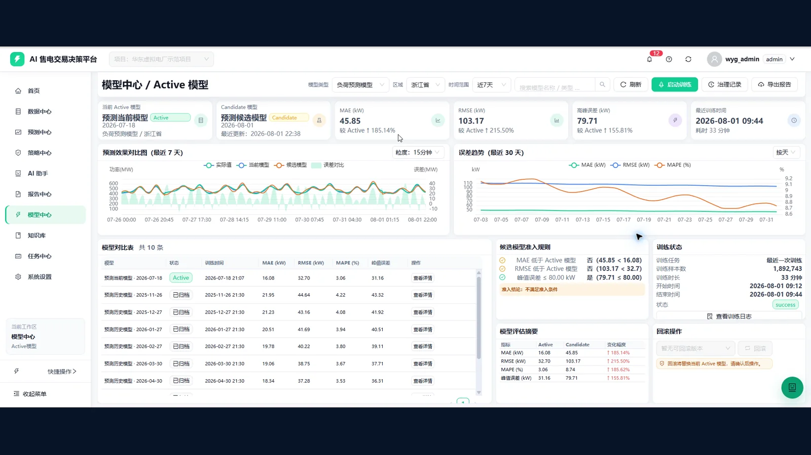<br><strong>Model Center</strong><br>Separates Active and Candidate models with admission gates.</td>
    <td>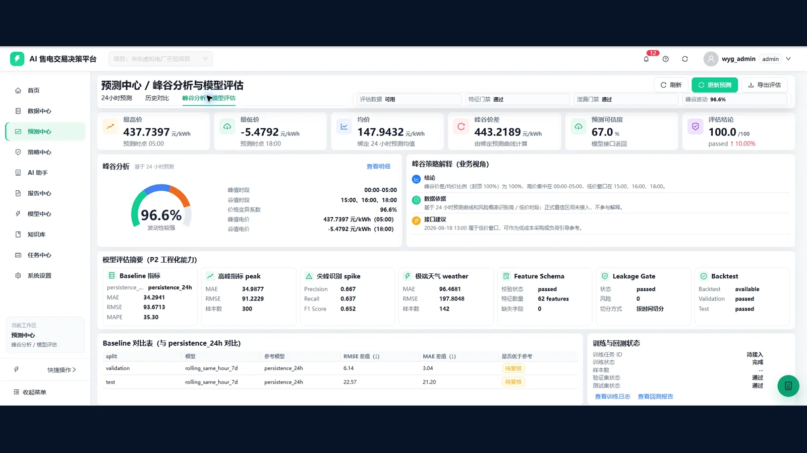<br><strong>Peak/Valley Analysis</strong><br>Explains extrema, spread, backtests, and feature gates.</td>
  </tr>
</table>

## Why this project exists

Operational data preparation, forecasting scripts, strategy analysis, knowledge search, and report writing often live in separate tools. That fragmentation makes timestamps difficult to reconcile, leaves strategy without model evidence, prevents knowledge reuse, removes citations from AI answers, and breaks continuity between analysis sessions.

Intelligent Operation connects PostgreSQL facts, forecast runs, risk windows, strategy review, enterprise RAG, AI responses, citations, traces, and memory on a shared lineage. Its purpose is not to replace business judgment; it helps an analyst answer where the data came from, why the model reached a result, what supports a recommendation, and what still requires human review.

<a id="core-capabilities"></a>
## Core capabilities

### 1. Data governance and operations dashboard

- Shared views for data quality, business time, refresh status, metrics, and risk windows.
- PostgreSQL is the primary fact store; the frontend accesses business data only through backend APIs.
- Loading, Empty, Error, Stale, Unauthorized, and Forbidden states are preserved rather than replaced with a successful mock response.
- Provenance, batch, scenario, and generation metadata remain available to controlled backend audit paths.

### 2. 24-hour forecasting

- Builds inputs from historical price, load, weather, and time features.
- Enforces 170 unique, ordered features; column, type, order, timezone, or schema-hash drift fails closed.
- Runs against an admitted Active artifact and persists exactly 24 consecutive hourly results on success.
- Tracks `run_id`, model version, feature version, input hash, and result hash.

> The public demonstration replays historical data. It is not presented as a live electricity-market forecast.

### 3. Risk and strategy evidence

- Identifies peak/valley periods, price volatility, confidence, and focus windows.
- Connects strategy suggestions to forecast facts and risk levels.
- Shares a traceable `run_id` across forecasting, strategy, and reporting.
- Keeps human review in the loop and does not execute trades, move funds, or control equipment.

### 4. Multi-model AI orchestration

- Routes configured MiMo, DeepSeek, and Kimi capabilities by general, analytical, visual, or premium workload.
- Combines rules, database-backed tools, RAG, and LLMs instead of sending every question to one model.
- Reports disabled, unavailable, or error when a provider is not configured or healthy.
- Reads provider credentials only from local secret configuration; keys do not belong in source, logs, or the browser.

### 5. Enterprise RAG and citations

- Covers document validation, parsing, chunking, hashing, embedding, Qdrant retrieval, and reranking.
- Requires agreement between the PostgreSQL release, Qdrant collection/alias, embedding dimensions, and model metadata.
- Citation Binding ties claims to retrieved evidence; insufficient evidence is a valid refusal outcome.
- The recorded demo environment contained `80+ documents` and `8k+ knowledge chunks`; those runtime assets are not bundled with the clean source snapshot.

### 6. Short- and long-term memory

**Short-term memory** carries recent intent, topic, focus, time window, answer constraints, and tool context through one session.

**Long-term memory** recalls admitted preferences across isolated sessions and records how memory was used. Candidate or inferred content is never described as a stored long-term fact before admission.

### 7. Governed forgetting

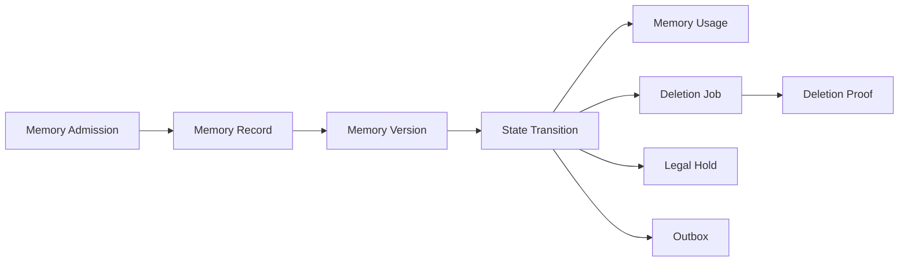

Memory is governed rather than accumulated indefinitely: admission, versioning, state transitions, usage tracking, deletion proof, legal hold, and outbox processing all have explicit roles. This is a backend governance domain; the project does not claim a complete end-user memory administration page.

### 8. Trustworthy AI engineering

- Answer Guard, Citation Binding, and Grounding constrain unsupported responses.
- Trace captures identity context, routing, tool calls, evidence, and response outcome.
- RBAC, tenant/workspace/user isolation, parameterized queries, and audit controls reduce unauthorized access.
- Explicit long-term memory operations fail closed; ordinary session-state failures are exposed as degraded components rather than crossing identity boundaries.

### 9. Model governance

- Tracks Active/Candidate state, model version, metrics, feature contracts, and training facts.
- A validated Candidate still requires human approval before promotion to Active.
- Rollback requires an explicit target and evidence; training is not presented as an automatic default closed loop.

<a id="architecture"></a>
## Architecture

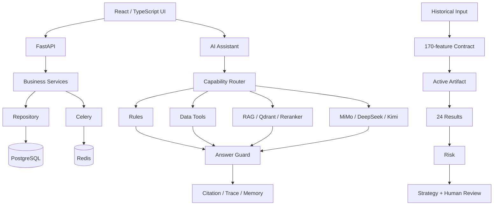

See [ARCHITECTURE.md](docs/ARCHITECTURE.md) for the prediction, RAG, Memory, and deployment boundaries.

## AI decision chain

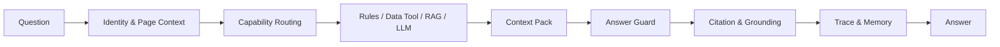

Identity and page context define who is asking and in which workflow. Capability routing selects rules, tools, RAG, or a model. The context pack organizes facts; Answer Guard applies output boundaries; Citation and Grounding bind evidence; Trace and Memory provide auditability and continuity.

## Engineering scale

| Dimension | Stable public figure |
|---|---:|
| Primary web modules | 10 |
| Declared controlled HTTP routes | 200+ |
| PostgreSQL domain tables | 80+ |
| Alembic revisions | 23, one head |
| Forecast feature contract | 170 |
| Hourly results per successful run | 24 |
| Documents in the recorded demo environment | 80+ |
| Knowledge chunks in the recorded demo environment | 8k+ |
| Cloud-model capability families | 3 |

Reproduction methods and runtime caveats are documented in [PROJECT_FACTS.md](docs/PROJECT_FACTS.md) and [PROJECT_FACTS.json](docs/PROJECT_FACTS.json).

## Engineering decisions

- End-to-end design from business requirements and data modeling to prediction, AI, and web delivery.
- Shared lineage across forecasts, reports, and strategies rather than treating script output as a complete system.
- Controlled domain tools instead of allowing an LLM to issue arbitrary SQL.
- Evidence and citations as RAG boundaries, with refusal when evidence is insufficient.
- Short/long-term memory designed together with governed forgetting.
- Capability-based provider routing with explicit unavailable and failure states.
- Fail-closed permissions, schema checks, migrations, and model admission.
- Integrated frontend, backend, database, ML, and AI engineering in one traceable workflow.

## Independently delivered scope

| Area | Independently completed work |
|---|---|
| Product and business | Requirement decomposition, workflows, information architecture |
| Data engineering | Data model, quality, time watermarking, fact lineage |
| Machine learning | Feature engineering, forecast contracts, model artifacts |
| AI engineering | Multi-model routing, RAG, Memory, Guard, Trace |
| Backend | FastAPI, services, repositories, RBAC, APIs |
| Frontend | React, TypeScript, ECharts, global AI assistant |
| Database | PostgreSQL, migrations, transactions, audit |
| Delivery | Startup, testing, version governance, open-source preparation |

The author independently completed the project from requirements and architecture through implementation and open-source delivery. Mature third-party frameworks and infrastructure remain under their own licenses; distributors should preserve the terms for the versions they resolve, and those components are not claimed as original work.

## Technology stack

| Layer | Technology |
|---|---|
| Frontend | React 18, TypeScript, Vite, Ant Design, ECharts |
| Backend | Python 3.11, FastAPI, Pydantic, SQLAlchemy |
| Data | PostgreSQL, Alembic, Redis, Celery |
| AI | MiMo, DeepSeek, Kimi, RAG, Qdrant, BGE, Reranker, Memory, Trace, Answer Guard |
| ML | scikit-learn, local model artifacts, strict feature contracts; optional XGBoost / LightGBM |
| Engineering | Pytest, Node Test Runner, TypeScript, Vite, Playwright, PowerShell / Bash, Docker Compose |

<a id="quick-start"></a>
## Quick start

Start with the core web application while external LLM and RAG features remain disabled. [QUICKSTART.md](docs/QUICKSTART.md) contains the full secret, administrator, database-role, health-check, Docker, and manual development workflows.

```powershell
git clone git@github.com:wyg916/PowerAnalytics.git
Set-Location PowerAnalytics
Copy-Item .env.docker.example .env.docker
# Replace secret and database-password placeholders locally.
docker compose --env-file .env.docker config --quiet
# Complete the controlled admin bootstrap in QUICKSTART.md, then:
docker compose --env-file .env.docker up -d --build
```

- Web: `http://127.0.0.1:8080`
- Health: `http://127.0.0.1:8000/api/health`

Source developers may also run FastAPI and Vite separately. The public snapshot intentionally excludes machine-specific internal launchers; see [QUICKSTART.md](docs/QUICKSTART.md) for the commands.

## Repository layout

```text
PowerAnalytics/
├─ frontend/             # React / TypeScript web workspace
├─ backend/              # FastAPI, domain services, repositories, AI, security
├─ prediction_engine/    # Feature building, training, backtesting, inference
├─ model_ops/            # Artifact admission, evaluation, lifecycle, rollback
├─ knowledge_pipeline/   # Validation, parsing, chunks, embeddings, release tools
├─ migrations/           # PostgreSQL Alembic migrations
├─ services/             # Cross-entry runtime and orchestration services
├─ tests/                # Backend, contract, AI/RAG, security, frontend tests
├─ docs/                 # Architecture, startup, demo, facts, public scope
├─ docker/               # Backend/frontend images and container scripts
├─ scripts/              # Startup, health, migration, governance, validation
└─ docker-compose.yml    # Local container orchestration
```

The public snapshot excludes raw corpora, model weights, databases, vector snapshots, internal audit evidence, and recording masters. See [OPEN_SOURCE_SCOPE.md](docs/OPEN_SOURCE_SCOPE.md).

## Use cases

- Electricity trading decision support
- Retail power operations analytics
- Electricity price risk assessment
- Enterprise knowledge Q&A
- Data analysis workspace
- AI-assisted decision workflows
- Model and strategy governance

## Scope of use

> The open-source version targets local deployment, technical exchange, and project demonstration. Forecast demonstrations replay historical data. The system does not execute automated trades, move funds, or perform production control actions by default.

This statement describes the current validation scope and default behavior; it does not restrict uses granted by AGPL-3.0-or-later.

## Roadmap

- More adapters for authorized real-time or near-real-time data sources
- Stronger offline model evaluation, drift monitoring, and admission evidence
- Better RAG quality evaluation, observability, and citation verification
- More portable local and scalable deployment options
- Configurable strategy templates for additional industry workflows

## Documentation

| Document | Purpose |
|---|---|
| [Quick Start](docs/QUICKSTART.md) | Environment, configuration, admin bootstrap, startup, health |
| [Architecture](docs/ARCHITECTURE.md) | Forecast, AI, RAG, Memory, and security boundaries |
| [Demo Guide](docs/DEMO_GUIDE.md) | Walkthrough, real screenshots, verified prompts |
| [Project Facts](docs/PROJECT_FACTS.md) | Scale figures, sources, reproduction |
| [Open-Source Scope](docs/OPEN_SOURCE_SCOPE.md) | Public allowlist, excluded assets, release gates |
| [Data and Model Assets](docs/DATA_AND_MODEL_ASSETS.md) | Data, corpus, model, vector, and rights boundaries |
| [Media Provenance](docs/media/README.md) | Provenance for real product captures and brand artwork |
| [AI Orientation](README.ai.md) | Concise context for AI tools and new maintainers |
| [Contributing](CONTRIBUTING.md) | Issues, branches, tests, PRs, Conventional Commits |
| [Security](SECURITY.md) | Private vulnerability-reporting expectations |
| [Third-Party Notices](THIRD_PARTY_NOTICES.md) | Dependency licenses, excluded assets, and downstream obligations |

## Contributing and feedback

- Suggestions and non-sensitive defects: [open an Issue](https://github.com/wyg916/PowerAnalytics/issues).
- Code changes: read [CONTRIBUTING.md](CONTRIBUTING.md) and submit a PR from `codex/<issue>-<topic>`.
- Use Conventional Commits and include test, risk, and rollback evidence in the PR.
- Never disclose security details publicly; follow [SECURITY.md](SECURITY.md) and first confirm that private vulnerability reporting is enabled.

## License

PowerAnalytics-owned source code and the repository's first-party documentation, brand artwork, and product screenshots are released under the [GNU Affero General Public License v3.0 or later](LICENSE). Operators who provide a modified version over a network should pay particular attention to the corresponding-source obligation in AGPL section 13.

Third-party libraries, containers, models, and user-supplied data remain under their own licenses or terms. This repository does not distribute model weights, raw corpora, databases, vector snapshots, or recording masters. See [THIRD_PARTY_NOTICES.md](THIRD_PARTY_NOTICES.md) and [DATA_AND_MODEL_ASSETS.md](docs/DATA_AND_MODEL_ASSETS.md).

---

The author independently designed and implemented the product architecture, business model, data lineage, forecasting engine, AI orchestration, enterprise knowledge workflow, memory governance, frontend/backend integration, and engineering delivery.
