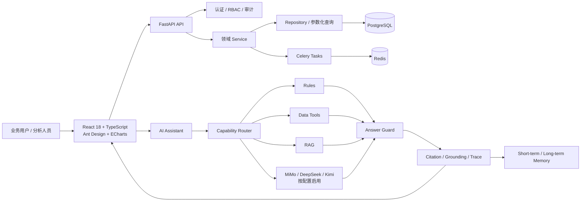
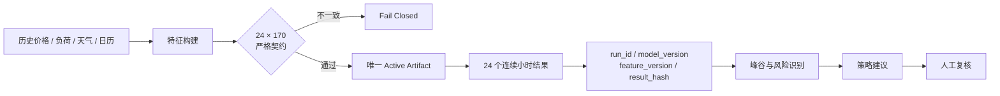
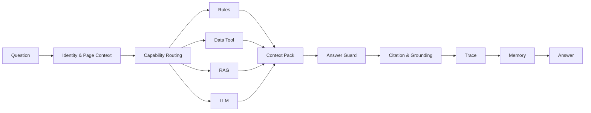
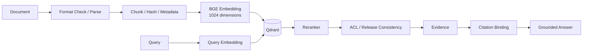
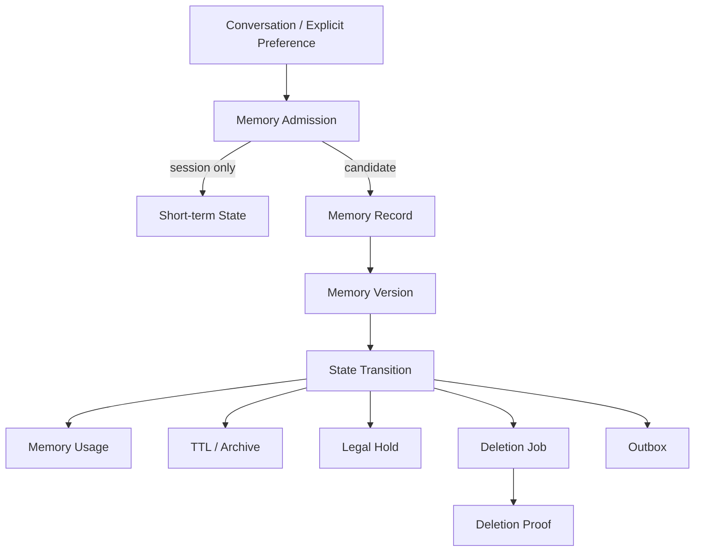

# PowerAnalytics 系统架构

本文描述公开版本 `v2.12.1-open-source` 的代码结构与运行边界。架构图表达组件职责，不代表生产 SLA、实时市场接入或自动交易能力。

## 总体分层

### 组件职责

| 层 | 主要路径 | 职责 |
|---|---|---|
| Web | `frontend/src/` | 十个业务模块、全局 AI 助手、权限路由与状态展示 |
| API | `backend/app/api/` | 受控 HTTP 接口、请求校验、认证与权限 |
| 领域服务 | `backend/app/services/` | 数据、预测、策略、报告、知识、模型、任务与 AI 编排 |
| 数据访问 | `backend/app/repositories/` | 参数化查询、事务边界和事实追踪 |
| 数据库 | `migrations/` | PostgreSQL Schema 与 Alembic 迁移 |
| 预测 | `prediction_engine/`、`model_ops/` | 特征构建、严格契约、Artifact 准入、评估和回滚辅助 |
| RAG | `knowledge_pipeline/`、`backend/app/services/rag_*` | 文档处理、Embedding、检索、重排、发布一致性和引用 |
| Memory | `backend/app/ai/`、`backend/app/ai_assistant/` | 会话状态、长期记忆准入、版本、使用与删除治理 |
| 异步任务 | `backend/app/workers/`、`scripts/` | Celery 队列、任务运行、健康检查和受控运维 |

## 预测事实链

关键约束：

- 输入必须包含 24 个连续、唯一小时和 170 个有序特征；缺列、多列、顺序、类型、时区或 Schema 不一致时拒绝运行。
- 成功的预测运行必须原子形成 24 条小时级结果；不完整批次不能作为首页、报告或策略的成功来源。
- Candidate 只有通过准入并经人工确认后才能成为 Active；公开版本不承诺自动晋升。
- 演示画面采用历史数据回放，不应解释为实时电力市场在线预测。

## AI 决策链

- **Identity & Page Context**：绑定 tenant、workspace、user、role、session 与当前页面，避免跨身份复用上下文。
- **Capability Routing**：按问题类型和权限选择规则、数据工具、RAG 或外部模型能力，并非所有问题都直接交给单个大模型。
- **Context Pack**：把结构化事实、工具结果、检索证据和会话约束组织成可审计输入。
- **Answer Guard**：校验证据、引用、敏感信息和回答边界；证据不足时应拒答或明确限制。
- **Citation / Trace / Memory**：记录引用绑定、工具调用和回答轨迹，并按治理规则使用短期或长期记忆。

## RAG 与 Citation

PostgreSQL 保存文档、Chunk、版本、发布与审计事实；Qdrant 承载向量检索。运行时必须校验发布版本、Collection/Alias、Embedding 维度与模型元数据的一致性。代码存在不等于新环境已经导入语料或发布索引。

## Memory 治理

记忆不是无限堆积。系统区分会话内容、长期候选和已接受长期记忆，并保留准入、版本、状态流转、使用追踪、TTL、删除证明、法律保留和 Outbox。仓库没有承诺一个面向终端用户的完整记忆管理页面；这里描述的是后端治理域。

## 安全与失败关闭

- 前端不直连数据库，只通过后端 API 获取业务事实。
- 数据工具采用受控能力和参数化查询，不允许模型执行任意 SQL。
- RBAC、租户/工作区身份、工具权限和审计记录共同限制访问。
- 查询接口不得隐式 Seed、迁移、激活模型或发布 RAG。
- 外部 LLM、RAG 模型与 Qdrant 未配置时应显示 disabled、unavailable 或 error，不伪造成功。
- 系统默认不执行自动交易、资金操作或设备控制动作。

## 部署边界

本地启动器、Docker Compose 与 RAG 预发布配置服务于开发和演示。模型权重、真实语料、数据库内容、Qdrant Snapshot、API Key 和本机运行配置不随公开源码提供。详情见 [快速开始](QUICKSTART.md)、[开源范围](OPEN_SOURCE_SCOPE.md) 与 [数据和模型资产](DATA_AND_MODEL_ASSETS.md)。
